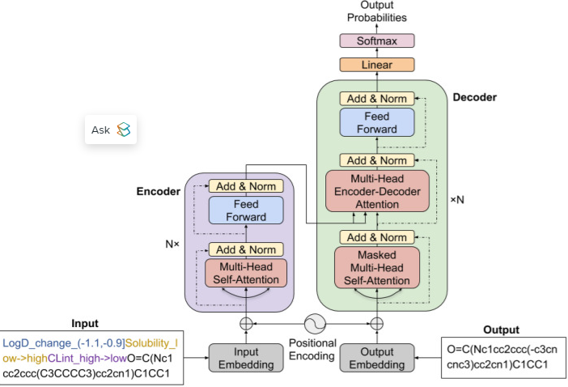
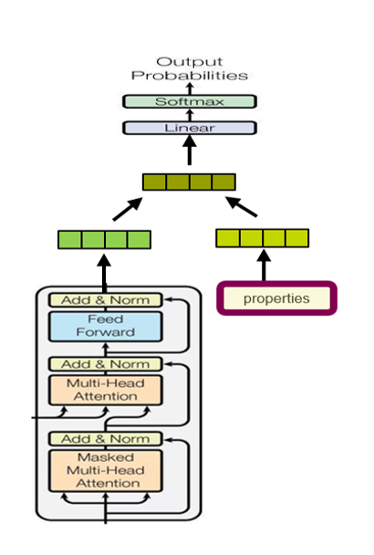
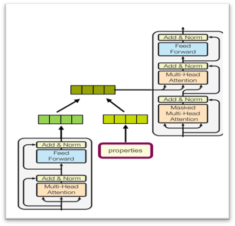
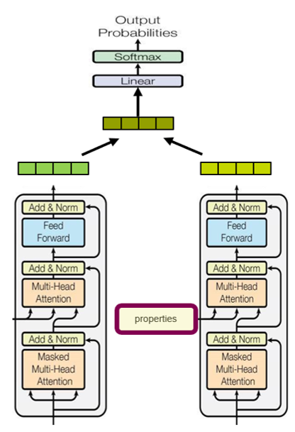

# Molecular Optimization by Capturing Chemist's Intuition using Deep Neural Networks
https://pubmed.ncbi.nlm.nih.gov/33743817/
---

## ✨ My work
We have implemented a Transformer-based architecture to realize the intuition-capturing and molecular generation phases. Our work includes:

* **Data Pipeline:** Extracting, cleaning, and filtering molecular data from public datasets to create a training set of expert-favored molecular transformations.
* **Core Model Development:** Building the fundamental Transformer-based model using **PyTorch**.
* **Architecture Exploration:** Investigating different approaches to integrate additional requirements (constraints/objectives) into the generation process to further guide model prediction.
The Basic model structure

I also explore the different approach to add additional requirement to guide model prediction

